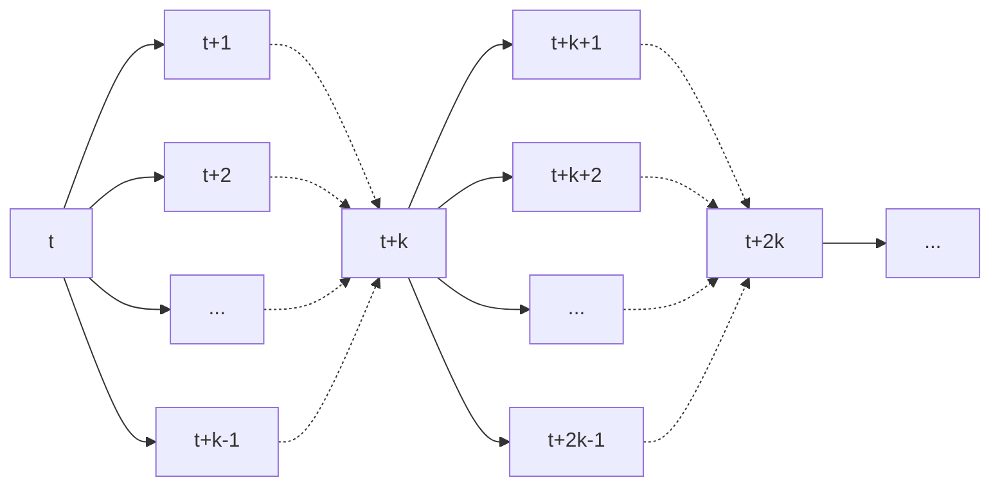

# Online learning — a Bayesian perspective
Gerardo Duran-Martin

---
layout: quote
---

# Begin Bayesian means using Bayes' rule*

*Not necessarily (although often used) for uncertainty quantification.

---

## Bayesian machine learning
Suppose we have ${\bm y}_{1:t}$ data available. The posterior predictive is
$$
    p({\bm y}_{t+1}\vert {\bm y}_{1:t}) =
    \int
    \overbrace{
    p({\bm y}_{t+1} \vert \boldsymbol\theta_t)
    }^\text{likelihood}
    \underbrace{
    p(\boldsymbol\theta_t \vert {\bm y}_{1:t})
    }_\text{posterior}
    d\boldsymbol\theta_t.
$$
with ${\bm y}_t$ the target variable and $\boldsymbol\theta_t$ the model parameters.

**Choices of likelihood**
* $p({\bm y}_{t+1} \vert \boldsymbol\theta) = {\cal N}({\bm y}_{t+1} \vert h_t(\boldsymbol\theta_t), R_t)$ (Homoskedastic regression)
* $p({\bm y}_{t+1} \vert \boldsymbol\theta) = \text{Bern}({\bm y}_{t+1} \vert \sigma(h_t(\boldsymbol\theta_t)))$ (Classification)

If $h_t(\boldsymbol\theta) = {\boldsymbol x}_t^\intercal \boldsymbol\theta_t$, then 1) is linear regression and 2) is logistic regression.

---
layout: quote
---

Estimating the posterior predictive is relatively straightforward,
The *computational problem* becomes estimating the posterior.

---

## (Batch) Bayesian machine learning
1. Target variable $y_t$,
2. mapping $h_t: \mathbb{R}^D \to \mathbb{R}$ (e.g. a neural network or linear mapping), and
3. random variable $\boldsymbol\theta_t$ parameterising $h_t$.

Bayesian ML estimates
$$
    \underbrace{
    p(\boldsymbol\theta_ t \vert y_{1:t})
    }_\text{posterior}
    \propto
    \overbrace{
    p(\boldsymbol\theta_t)
    }^\text{prior}
    \underbrace{
    p(y_{t:1} \vert \boldsymbol\theta_t)
    }_\text{likelihood}.
$$
---

### (Batch) Bayesian ML
For specific choices of $h_t$ and prior $p(\boldsymbol\theta)$, finding $\boldsymbol\theta_* = \arg\max_{\boldsymbol\theta}p(\boldsymbol\theta \vert y_{1:t})$ recovers
1. Ridge regression,
2. Lasso,
3. Logistic regression,
4. Neural networks with L2 regularisation.

MAP estimate of a posterior distribution $\implies$ a regularisation scheme.

---

# Offline ML
Expected RMSE

If the data is i.i.d.,

$$
    \mathbb{V}[{\bm y}_{t + \ell} \vert {\bm y}_{1:t}] \approx \mathbb{V}[{\bm y}_{t + m} \vert {\bm y}_{1:t}],
$$
for any $\ell > m > 0$.

---

# Offline ML in online scenario
In a time-dependent task, we usually observe model degradation, i.e.,
$$
    \mathbb{V}[{\bm y}_{t + \ell} \vert {\bm y}_{1:t}] > \mathbb{V}[{\bm y}_{t + m} \vert {\bm y}_{1:t}],
$$
for $\ell > m$.

---

### Example: daily AUC over time for classification of toxic flow
See [Cartea et al. 2023](https://arxiv.org/abs/2312.05827).

---

# Overcoming performance degradation
If data is not i.i.d., then 
1. When to update?
2. How much past information to consider for the update?
3. How much data is stale?
4. What's the cost of updating?

---

### Offline ML
Predict / update with sliced information

---

## Overcoming performance degradation (cont'd)

---

# (Online) Bayesian learning
Rewriting Bayes' rule

One observation | one update.
$$
    \underbrace{
    p(\boldsymbol\theta_ t \vert y_{1:t})
    }_\text{posterior}
    \propto
    \overbrace{p(\boldsymbol\theta_t \vert y_{1:t-1})}^\text{prior predictive}
    \underbrace{p(y_t \vert \boldsymbol\theta_t)}_\text{likelihood}.
$$

---

# Online ML

The goal is to estimate the one-step-ahead forecast 
$$
    \mathbb{E}[y_{t+1} \vert y_{1:t}],
$$
or $\ell$-step-ahead forecast
$$
\mathbb{E}[y_{t + \ell} \vert y_{1:t}].
$$
With $\ell \geq 1$ and $y_t$ the target variable.

---

## Online-learning via state-space models (SSMs)
Assume model parameters follow a random walk.

$h_t$ does not have enough capacity to accommodate all
incoming information (big world, small model assumption).

So that
$$
    p(\boldsymbol\theta_t \vert \boldsymbol\theta_{1:t-1})
    = p(\boldsymbol\theta_t  \vert \boldsymbol\theta_{t-1})
    = {\cal N}(\boldsymbol\theta_t \vert \boldsymbol\theta_{t-1}, Q_t).
$$
 
Here, $Q_t$ is a *synthetic* shock to the system — avoids convergence to a 0-learning rate.

---

## SSMs — linear regression example
Assume $p(y_t \vert \theta_t) = {\cal N}(y_t \vert h_t(\boldsymbol\theta_t, R_t))$ with $h_t(\boldsymbol\theta_t) = {\bf x}_t^\intercal\boldsymbol\theta_t$.

The *predict* and *update* steps are given by

$$
\begin{aligned}
    p(\bm\theta_t \vert \bm y_{1:t-1}) &= \int p(\bm\theta_t \vert \bm\theta_{t-1}) p(\bm\theta_{t-1} \vert \bm y_{1:t-1}) d\bm\theta_{t-1} \quad \text{(predict)}\\
    p(\bm\theta_t \vert \bm y_{1:t}) &\propto p(\bm\theta_t \vert 
    \bm y_{1:t-1}) p(\bm y_t \vert \bm\theta_t) \quad \text{(update)}
\end{aligned}
$$

---

### Predict step
$$
p(\bm\theta_t \vert \bm y_{1:t-1}) =
{\cal N}(\bm\theta_{t} \vert \bm\mu_{t|t-1}, \bm\Sigma_{t|t-1})\\
$$
with
$$
\begin{aligned}
    \bm\mu_{t|t-1} &= \bm\mu_{t-1}\\
    \bm\Sigma_{t|t-1} &= \bm\Sigma_{t-1} + Q_t
\end{aligned}
$$

---

### Update step
$$
    p(\boldsymbol\theta_t \vert y_{1:t})
    = {\cal N}(\boldsymbol\theta_t \vert \boldsymbol\mu_t, \boldsymbol\Sigma_t)
$$
with
$$
\begin{aligned}
{\bf K}_t &= \bm\Sigma_{t|t-1}{\bf x}_t({\bf x}_t^\intercal \bm\Sigma_{t|t-1} {\bf x}_t + {\bf R}_t)^{-1}\\
\boldsymbol\mu_t &= \boldsymbol\mu_{t-1} + {\bf K}_t(y_t - {\bf x}_t^\intercal\boldsymbol\mu_{t-1})\\
\bm\Sigma_{t} &= \bm\Sigma_{t|t-1} - {\bf K}_t{\bf x}_t^\intercal\bm\Sigma_{t|t-1}
\end{aligned}
$$

---

## Online learning v.s. batch learning
Random forest(RF) and a recursively-updated 2-hidden-layer neural network (PULSE) trained online using only 0.3% of all degrees of freedom.

---

# Online learning as a changepoint detection problem
Based on the work by [Adams and Makay. 2007](https://arxiv.org/abs/0710.3742).

Let $r_t$ be the number of timesteps from the last changepoint (the runlength).

Extend the state-space as
$$
\begin{aligned}
    p({\bm y}_{t+1} \vert {\bm y}_{1:t})
    &= \sum_{r_t} p({\bm y}_{t+1}, r_t \vert {\bm y}_{1:t})\\
    &= \sum_{r_t}
    \overbrace{
        p({\bm y}_{t+1} \vert {\bm y}_{t - r_t:t})
    }^{r_t - \text{posterior predictive}}
    \underbrace{
        p(r_t \vert {\bm y}_{1:t})
    }_{r_t - \text{posterior}}.
\end{aligned}
$$

---

## What does a changepoint mean?
The value
$$
        p({\bm y}_{t+1} \vert {\bm y}_{t - r_t:t})
        =
        \int
        \overbrace{
        p({\bm y}_{t+1} \vert \boldsymbol\theta_t)
        }^\text{likelihood}
        \underbrace{
        p(\boldsymbol\theta_t \vert {\bm y}_{t-r_t:t})
        }_\text{posterior}
        d\boldsymbol\theta_t
$$
is the posterior predictive using **only** the last $r_t$ observations.

The value
$$
p(r_t \vert {\bm y}_{1:t})
$$
is the posterior distribution that a changepoint occurred $r_t$ observations ago.

--- 

## BOCD for Linear regression — an example
Datapoints are sampled from

$$
\begin{aligned}
    y_t &\sim {\cal N}(\phi(x_t)^\intercal\theta_t, 1)\\
    x_t &\sim {\cal U}[-2, 2] \\
\end{aligned}
$$
with
$$
    p(\theta_t \vert \theta_{t-1}) =
    \begin{cases}
    \theta_{t-1} & \text{w.p. } 1 - \epsilon\\
    {\cal U}[-3, 3]^3 & \text{w.p. } \epsilon
    \end{cases}
$$

---

## BOCD for LR (cont'd)
Observations are shown to the algorithm without any mention of changepoint events.

---

### BOCD — runlength posterior log-probability

---

### BOCD — posterior-predictive

---

# Summary
1. Modelling of non-stationary data using stationary models leads to performance degradation.
2. Bayesian online learning is a natural way to model time-dependent / non-stationary data.
3. Changes in the data are modelled using latent variables. E.g.
    * runlength in BOCD, or
    * dynamic model parameters in SSMs.
4. Key challenge is the computational cost of estimating the posterior.

---
layout: end
---
fin.
